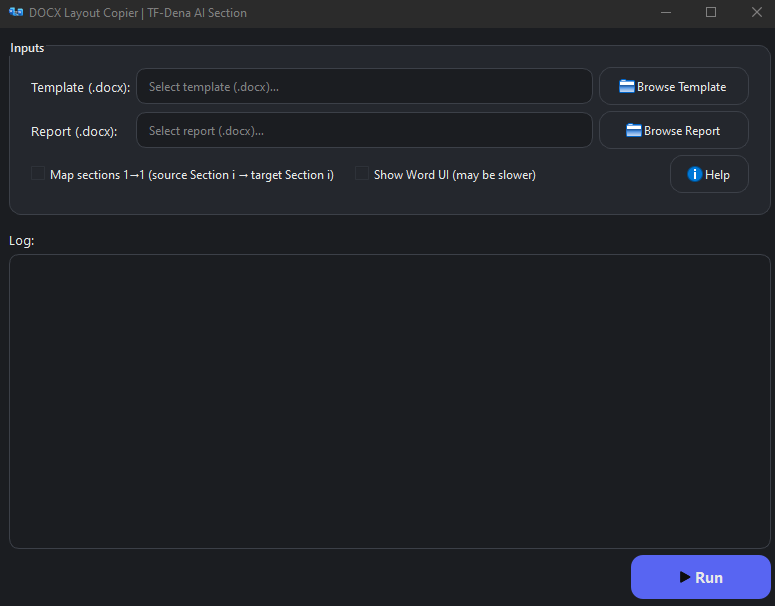

# DOCX FEATURE COPIER
<div align="center">

  

  <p>
    <strong>DOCX FEATURE COPIER Software</strong>
  </p>


</div>

To expedite report preparation in Microsoft Word and rely on the structure and formatting of previously approved files, we decided to use a supplementary program to transfer all features and formatting from an approved report template to a new report template.

Goals
Using the DOCX Layout Copier program, you can transfer all styles, layout, and page borders from a template file to your desired report file.

## Install & Test

```bash
pip install -r requirements.txt
```

```bash
python main.py
```
